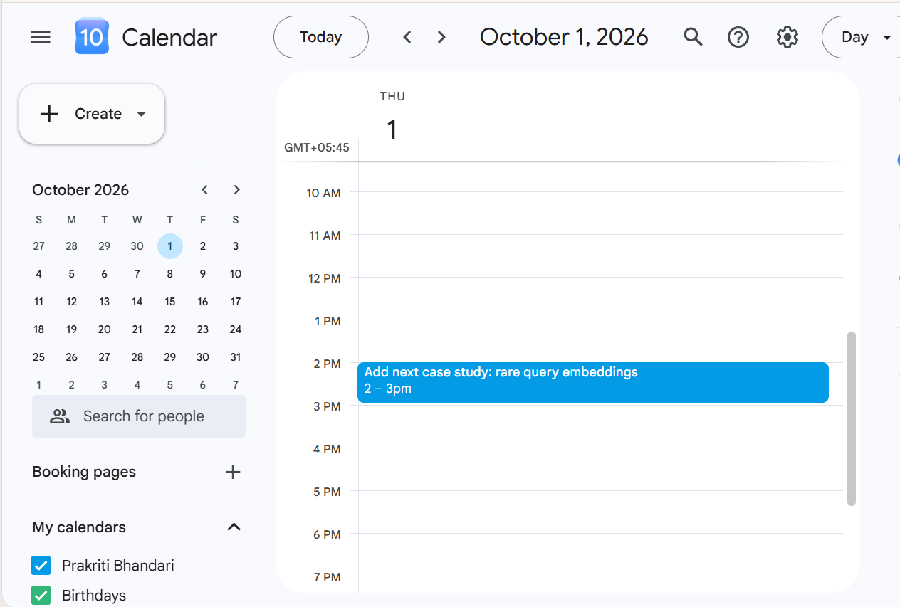

# FlyRank ML Internship Capstone

## Deliverables Index

- **Paper (deployed)**: https://idyllic-sable-191e16.netlify.app/
- -paper :https://prakritibhandari07.github.io/FlyRank-ml-internship/
- **Capstone Notebook (Week 8)**: https://github.com/Prakritibhandari07/FlyRank-ml-internship/blob/main/work/notebooks/capstone.ipynb 
- **Demo Outline + Shareable Cuts**: Inside the capstone notebook (last markdown cells)  
- **README (Documentation)**: This file
- - **Reminder Evidence**: 
- **Demo Video (3–5 min)**: https://www.loom.com/share/f9991e96a69240eabf71144ebb9574da

- **Retrospective (Week 10)**: [Retrospective.md](work/Retrospective.md)  
- **Hours Log**: Completed in portal (not public)  


## What it does and for whom
This project builds and evaluates a ranking model on FlyRank’s anonymized production dataset.  
It is designed for AI/ML learners, reviewers, and employers to demonstrate applied machine learning at scale.

---

## Setup Instructions
A stranger should be able to reproduce this setup:

```bash
# Clone the repo
git clone https://github.com/Prakritibhandari07/FlyRank-ml-internship.git
cd FlyRank-ml-internship

# Install dependencies
pip install -r requirements.txt

# Run the notebook
jupyter notebook work/notebooks/capstone.ipynb
